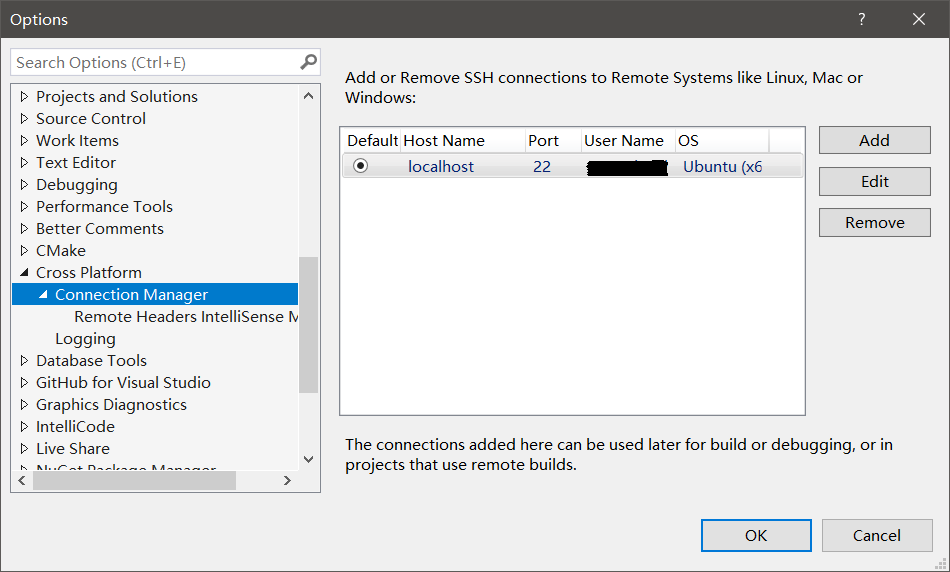

# Environment

Install IDE and WSL:
- VS2019 with linux C++ package
- Ubuntu in WSL

## WSL Configuration

Install some software and library in Ubuntu:

```shell
sudo apt install g++ gdb make rsync zip cmake
sudo apt-get install openssh-server
```
config SSH in WSL
```shell
sudo vi /etc/ssh/sshd_config
```
change 
```
#PermitRootLogin prohibit-password
#StrictModes yes
```
to 
```shell
PermitRootLogin yes
StrictModes yes
```

run this to restart SSH

```shell
sudo service ssh restart
```

## Connect to WSL

In Visual Studio 2019, choose:

```
Tools-Options-Cross Platform-Connection Manager
```

to add your connection to WSL, the host is `localhost`.



## Get the code

Use `git clone` to download this project in your Windows and open it with Visual Studio 2019( File - Open - CMake)

# Compile libkvs.so

Run `Build All` in VS2019 to build libkvs.so, a file called `libkvs.so` will generate in  `out/build/WSL-GCC-Debug`. Run `Clean` in VS2019 to clean it.

# Original README

The original version of this project was developed by [Wadeleng](https://github.com/WadeLeng/key-value-system). It's original README context is:

```
================================================================
 KVSystem: a Key Value system Version 0.1
================================================================
   README		- this file

Contents of the directory tree is below.

  ./		- sources of key-value-system
  ./doc		- documents 
  ./test	- test all_module, correct, stress.

KVSystem was written by FoOTOo Lab. You can contact the author by e-mail to:
"wade.hit@gmail.com" or "takanoter@gmail.com"

Thanks.

== END OF FILE ==
```

