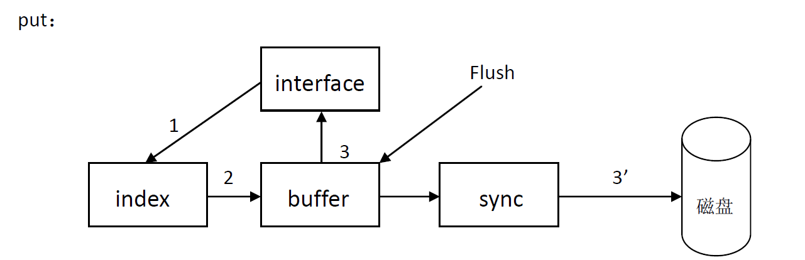

# key-value-system设计文档
## 要求

- 项目：单机key-value存储系统
- 数据规模：单机存储1000W条记录，平均大小100KB，单机存储1TB数据，单条最大长度5MB
- 响应时间：平均单次请求在50ms内完成（SATA硬盘） 
-  接口：put(key, value), get(key), delete(key) 
- 代码估计：5000行

## 总体设计

系统分成5个模块：
1. interface模块：对外提供的接口模块，支撑KV系统，连接各个模块，安排程序的执行流程。
2. index模块：根据key值，来提供插入、删除、查找结构体IDX_VALUE_INFO的信息。由IDX_VALUE_INFO可以知道value存放的位置和value的大小。
3. buffer模块：把value缓存写 在buffer里，使得数据写到磁盘上能够“局部顺序写”，减少写I/O时间。另一方面buffer可以当缓存读，减少读I/O时间。Buffer里同时有一个线程监视buffer的情况，适时把value写到磁盘上。
4. sync模块：提供“内存与磁盘间”读写操作的接口，index模块持久化接口。
5. log模块：提供log输出接口。
系统有3个文件： disk_file——存放value的大文件。 IMAGE_file——index模块在内存中的镜像，下次运行可以载入内存继续运行。 log_file——系统输出的log信息，可以提示错误。

## 各模块详细设计
- interface模块详细设计

