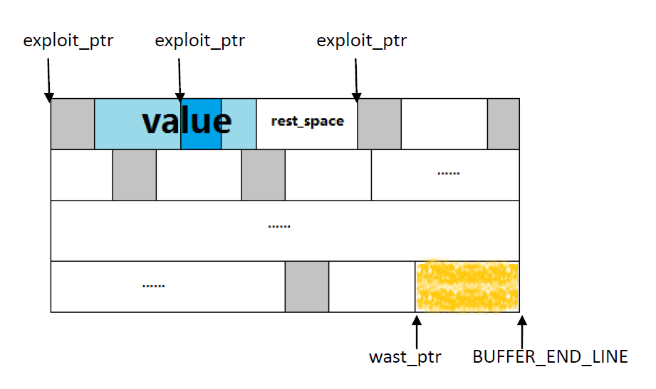

# key-value-system设计文档
## 要求

- 项目：单机key-value存储系统
- 数据规模：单机存储1000W条记录，平均大小100KB，单机存储1TB数据，单条最大长度5MB
- 响应时间：平均单次请求在50ms内完成（SATA硬盘） 
-  接口：put(key, value), get(key), delete(key) 
- 代码估计：5000行

## 总体设计

系统分成5个模块：
1. interface模块：对外提供的接口模块，支撑KV系统，连接各个模块，安排程序的执行流程。
2. index模块：根据key值，来提供插入、删除、查找结构体IDX_VALUE_INFO的信息。由IDX_VALUE_INFO可以知道value存放的位置和value的大小。
3. buffer模块：把value缓存写 在buffer里，使得数据写到磁盘上能够“局部顺序写”，减少写I/O时间。另一方面buffer可以当缓存读，减少读I/O时间。Buffer里同时有一个线程监视buffer的情况，适时把value写到磁盘上。
4. sync模块：提供“内存与磁盘间”读写操作的接口，index模块持久化接口。
5. log模块：提供log输出接口。
系统有3个文件： disk_file——存放value的大文件。 IMAGE_file——index模块在内存中的镜像，下次运行可以载入内存继续运行。 log_file——系统输出的log信息，可以提示错误。

## 各模块详细设计
- interface模块详细设计


流程： 

1. 把key插入到index中，并且返回和key相关联的value_info地址给buffer。 

			2. 调用buffer_put，传入value内容和记录value信息的value_info地址并在buffer中填写
   			3. 返回调用。同时buffer_put中lookout线程满足flush条件则把value以包的形式（多条value）写到磁盘。


流程： 

1. 调用idx_search，在index模块里根据key，返回value_info。 
2.  根据value_info，如果value在buffer里直接从buffer读出value，返回。 
   1.  否则value会在磁盘里，调用sync_read，从磁盘读出value，返回。


流程：

1.调用idx_delete(),删除idx_node并返回value_info。 

2.根据value_info，如果buffer里有value，删除value。（这样可以在buffer写到磁盘前就删除，不用占用磁盘I/O资源。）

- index模块详细设计

idx_nodes是index存放struct IDX_NODE的池，对idx_nodes池的操作有：申请一个struct IDX_NODE和释放一个struct IDX_NODE。


free_idx_nodes是一个栈，初始情况把所有可用的node_id都压入栈，_get_free_idx_node()弹栈，_put_free_idx_node()压栈。


ht_table是一个hash表，冲突的元素以树的形式连接在表后（拉链法的变形），可以在检索数据的时候提升速度。

Index layout:


说明：索引的设计中，并没有存入 key 值，而是通过以下方式防止哈希冲突的：
	(1)  hash 槽的选择：ht_table_id = hash_func_1(key);
	(2)  树中偏序关系的维护：<hash_func_2, hash_func_3>
    实验中， 在一个 hash 槽内插入 2000W 条随机生成的 32 位 key 值，没有出现冲突。

- buffer模块详细设计

value在buffer里的存放形式是：struct buf_word + value，如下图灰色和白色。 对程序中各个变量的说明:


buf_pool：buffer池的首地址，每次把buffer写满了，相关变量重置为buf_pool位置。进行下一趟操作。 

last_ptr： 空闲空间的地址。每次存放完value之后，指针移到value后面，value是一个接着一个存放的。 

buf_word_ptr：指向struct buf_word的指针。 

buf_value_ptr：指向value的指针。



蓝色（深蓝和浅蓝）部分是第二趟写的value。深蓝色表示的是这个value覆盖了上次一个buf_word，后面的rest_space是这次开拓的空间剩下的部分，可以给下次用。最后面的黄色是荒废区。如果某一次的value_size太大，以至于后面的空间不够必须重头再重新开拓空间，那么这个黄色区域就舍弃掉了，直接从头重新开拓空间。避免出现value分开的情况。 

exploit_ptr：除了第一趟（first_flag = 1，从buf_pool到BUFFER_END_LINE）直接把value一个接着一个地放到空闲空间外，以后每次放一个value都需要先“开拓”空间，并修改struct buf_word。exploit_ptr就是这个开拓指针。这样做的目的如下：1.防止覆盖旧的有效的value。2.把value flush到磁盘以后，还可以有缓存读（cache）的功能。具体详见struct buf_word->priority说明。

rest_space：每次开拓的空间肯定会“大于等于”value_size，这次剩下的空间叫rest_space，可以放到下次开拓的空间里供下次使用。 wast_ptr：荒废区的首地址。 

last_waste_ptr：上一趟的荒废区的首地址。 

last_flush_ptr：上次把value flush到磁盘的地址。 

not_flush_size：没有flush到磁盘的value的总大小（不包括struct buf_word）。给监视线程用的 

first_flag：第一趟写buffer的标志，这个时候不需要开拓空间。所有空间都是可用的。 

disk_ptr：磁盘的空闲地址。这个版本暂时没有disk这个模块，磁盘地址放到buffer中。

```c
enum priority_t { p_unavail, p_flushed, p_not_flush }; 
typedef struct { 
    struct IDX_VALUE_INFO* value_info_ptr; 
    enum priority_t priority; 
}buf_word;
```

priority有3个值：p_unavail, p_flushed, p_not_flush； 

p_unavail代表结构体后面的value已经无效（被删除）了。 

p_flushed代表结构体后面的value已经flush到磁盘上，但是在buffer中还是有效的。可以通过buf_ptr找到value。 

p_not_flush代表结构体后面的value还没有被flush到磁盘上。
这里之所以要value_info_ptr，是因为以下情况需要修改value_info的变量：第二趟以后，每次开辟空间，要把value_info里的buffer_ptr置为NULL（表示value已经不在buffer里，priority = 1），代表不能通过buffer_ptr在buffer里读value了，此时只能在磁盘上获取value。 

buffer_put过程比较复杂，说明一下buffer_put的流程： 

先保证，这趟下来，后面的空间肯定能放下value的值，不然，把剩下的空间设为荒废区，从头重新开始。 

如果是第一趟在buffer里存value，那么直接一个接着一个地存放数据。 否则， 先开辟足够大的空间。开辟的过程包括修改buf_word_ptr->valu_info的值和priority的值。 如果这次放完value，exploit_ptr进入了荒废区，那么后面的空间不要了，因为荒废区不符合开辟的条件。

监视线程的流程：

触发写磁盘的动作是：每过SLEEP_TIME后检查没有flush的value总数（称作包）是否超过一个标准值：BUFFER_HORIZON_SIZE，如果SLEEP_TIME过后，还不到这个值，就不flush，理由是flush的数量太小，局部顺序写的效果不明显。 

当主线程执行buffer_exit()时，给监视线程发取消请求，监视线程把剩下的所有没flush的value都flush到磁盘上，线程结束，buffer_exit()退出。 

触发条件：SLEEP_TIME && BUFFER_HORIZON_SIZE 

buffer各种例子的演示： 假设需要put的value有如下顺序：20、70、20、10、10、30、85、30 第一趟结果各value的state：


现在删除70和20：


监视线程flush了20、10、10，注意70和20已经删掉，不需要flush：


第二趟put 20、85之后的情况，rest_space剩余5供下次put 30使用，其中value_6把value_1覆盖的时候已经通知value_2对应的value_info，buf_ptr已经无效，依此类推：


put 30后的state：


- sync模块详细设计

I/O比较：从mmap, read, fread三个文件I/O来看，本质上都是在操作系统的cache和VM层之上工作，但与cache的距离越来越远。mmap让应用直接读写cache，read必须做一次向用户空间的搬运，fread还要经过libc这一层。所以选择mmap较好。因为数据较大，和系统限制等客观原因，这个版本暂时使用read, write作为选择。后续版本会做mmap版本，并和read/write做性能上的比较测试。 

这个模块除了sync_read()和sync_write()外，还提供了index模块持久化的接口。

## 后续改进

1. KVS_ENV 启动配置信息参数较少，之后提供 Direct_IO 参数，可以把 buffer 模块变成可配置的。
2. sync 模块磁盘的读写操作的选择 read/write, mmap 等等选择对比。
3.  提供 Server 端，使数据能在远程调用系统接口。
4. disk_file 没有做磁盘碎片回收机制，后续增加。
5. index 后续要有实时的同步到磁盘上，防止断电等意外出现后数据丢失找不到。
6.  给多种语言提供接口。
7. ……